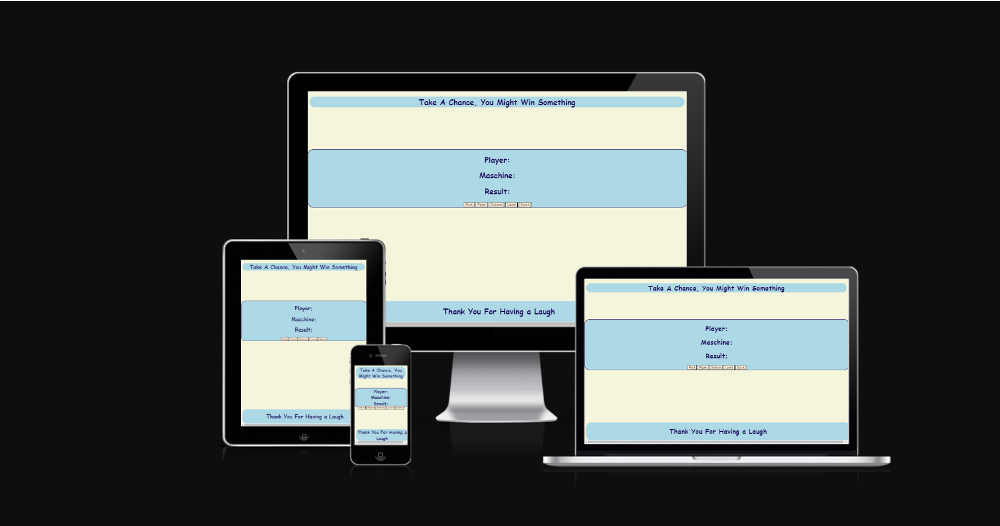
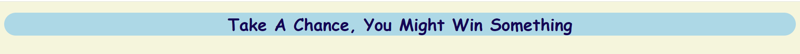
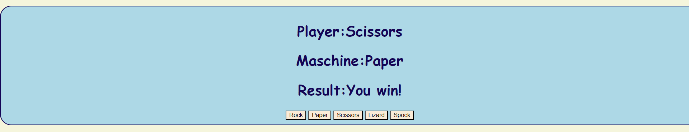
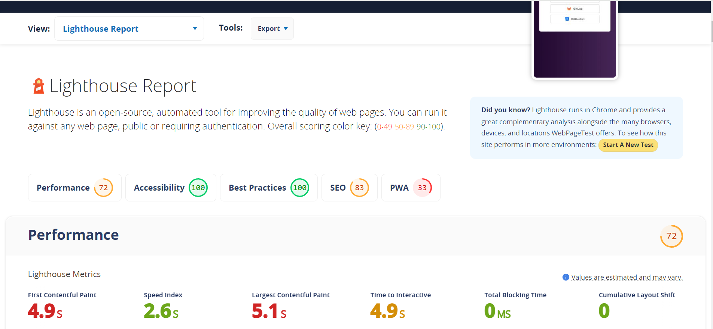
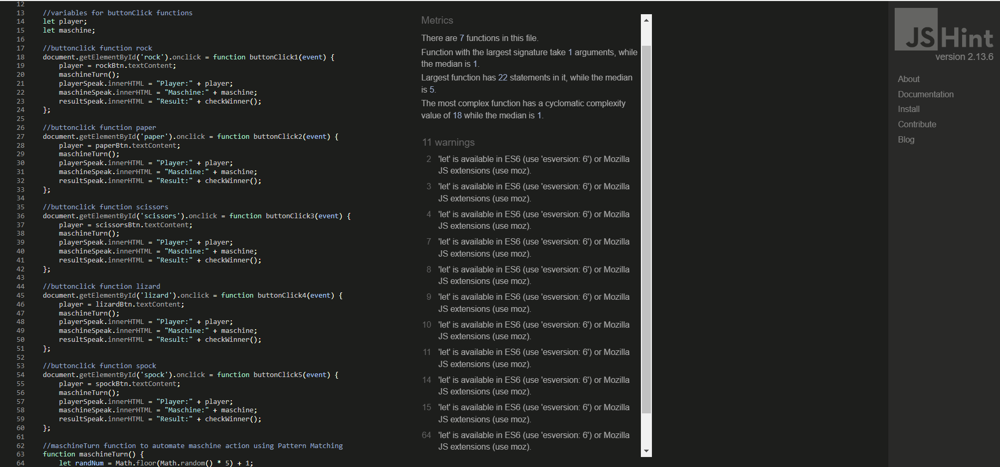

# Rock Paper Scissors Lizard Spock

This site has been designed to target a younger audience during those in-between study times when they need to burn off some steam. It is a variant of the popular Rock-Paper-Scissors game with a twist that youngsters of all ages can enjoy. 

The user faces off against the maschine in this game of chance, and everything is simple and easy to navigate and understand. The colors chosen were intended to be relaxing and communicate low pressure. Just a fun way to cool off the brain for a few minutes.

## Features

### Existing Features

- Header
    - The header acts as a simple and easy to read call to action.
    - The font is clear and it is styled to flow harmoniously with the rest of the page.

- Game Options
    - The main game interface sits in the center of the and the user my choose of the five buttons to initiate the interactivity. 
    - The functionality is intuitive.

- Game Results
    - When a button is chosen, Javascript will capture the input and compare it to a randomly generated output by the Maschine. The result, and in this case winner, will be returned to the screen.

- Footer
    - The footer gives kind regards for engaging with the webpage.

## Testing

- The page has been tested in multiple browsers.
- The page returns the correct responses, reliably.
- All text is readable.
- Lighthouse scores can be found below.

### Validator Testing
- No errors were returned when run through the W3C Validator
- No errors were returned when run through the Jigsaw Validator
- No errors were returned when run through JSHint

## Deployment

- The site was deployed to Github Pages the steps to deployment are as follows:
    - In the Github Repository, nabigate to the settings tab.
    - Navigate to the pages section.
    - From the source section, select Main Branch.
    - Save (I have on occasion needed to rename the project and start again to receive an active link.)

## Credits

- [CodeCademy Forum](https://www.codecademy.com/) provided assistance with the game logic.
- [Bro Codes](https://www.youtube.com/@BroCodez) also provided assistance with the game logic.
